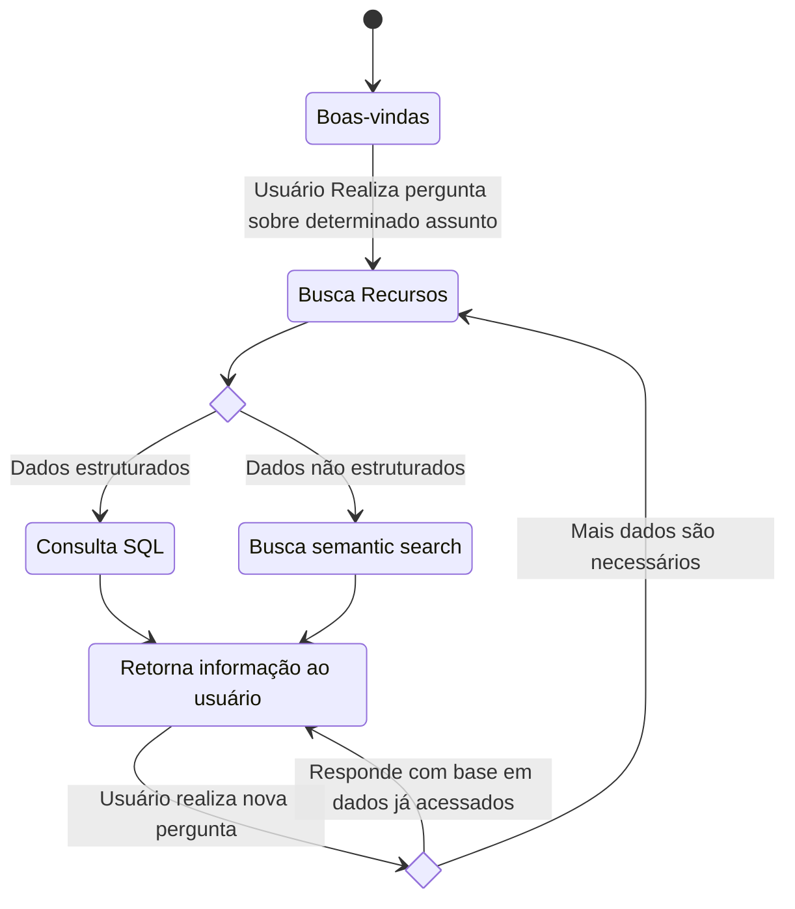
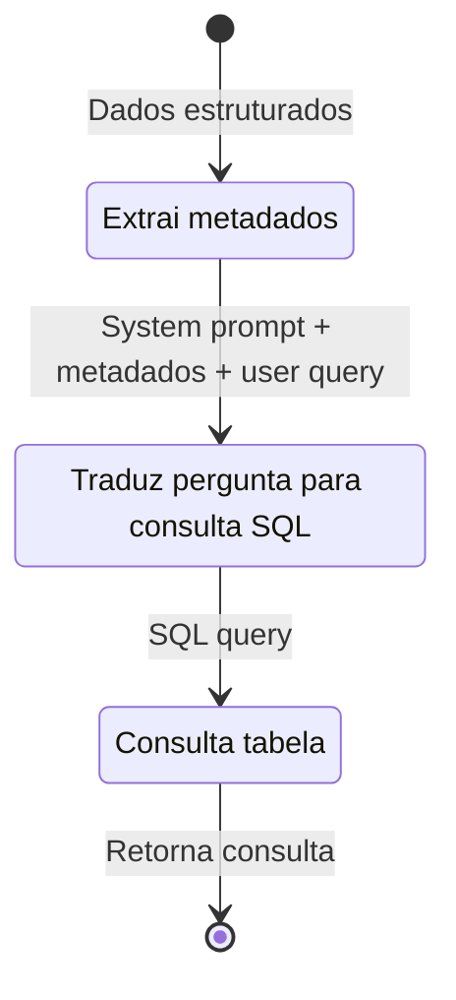

# Chatbot para extração e interpretação de dados governamentais

## Descrição

Esse projeto visa construir um chatbot que não apenas extrai dados governamentais abertos do governo brasileiro, mas também é capaz de interpretá-los em uma linguagem acessível para a população, dessa forma ajudando na missão de tornar os dados públicos acessíveis para qualquer pessoa sem a necessidade de um conhecimento mais especializado.
## Arquitetura Chatbot
### Panorama geral

#### Explicação

1. **Boas vindas :** Dá boas vindas ao usuário e explica brevemente como o sistema funciona.

2. **Busca por Recursos:** Busca por recursos relevantes com base na query do usuário utilizando semantic search sobre os metadados do portal de dados abertos do governo federal.

3. **Gera SQL:** Transforma dada estruturado em tabela que pode ser consultada a partir de consultas SQL, depois traduz query do usuário em linguagem natural para código em SQL a fim de realizar consulta em dados estruturados.

4. **Busca semantic search:** Fatia arquivo em texto e cria uma VectorStore, a partir disso usa semantic search para fazer busca em trechos relevantes do texto com base na query do usuário.

5. **Retorna dados ao usuário:** Os dados são retornados ao usuário com uma apresentação destacando pontos principais. Os dados podem ser retornados em representações visuais como tabela ou gráficos(ainda em desenvolvimento)
### Busca por recursos
### RAG em dados estruturados

Esse modulo consiste em instruir uma LLM para gerar código SQL utilizando os metadados e a pergunta do usuário a fim de extrair informações significativas de dados estruturados

**Explicação**

**User query:** Pergunta do usuário a respeito de determinado tema.

**Metadados:** Informações a respeito dos dados estruturados, como nomes de colunas, tipos de colunas, amostras da tabela e tamanho da tabela.

**System prompt:** Contém instruções as quais o modelo de linguagem (LLM) deverá seguir para criar consulta SQL utilizando os metadados e a user query. Essas instruções incluem objetivos, restrições, formatação de entrada(metadados+user query) e saída(Código SQL gerado pelo modelo) que modelo deverá seguir.
  

### RAG em dados não estruturados

  

## Referenciais:

  

[9]A Chatbot for Searching and Exploring Open Data: Implementation and Evaluation in E-Government